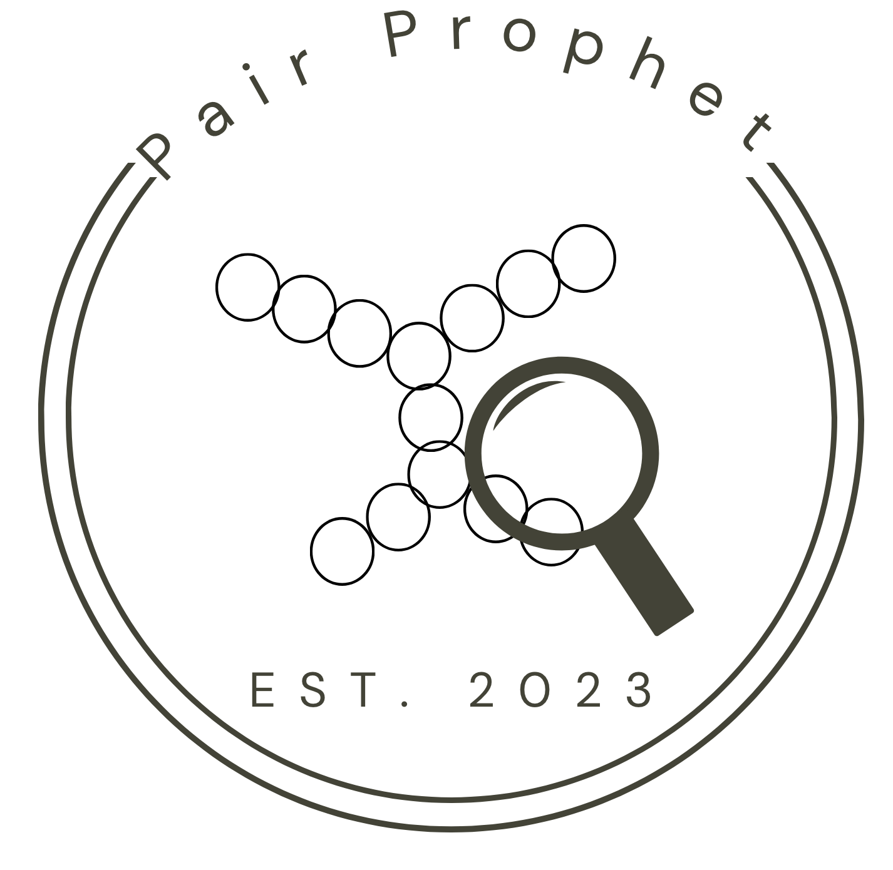

.. PairPro documentation master file, created by
   sphinx-quickstart on Sun May 14 13:41:35 2023.
   You can adapt this file completely to your liking, but it should at least
   contain the root `toctree` directive.

Welcome to PairProphet's documentation! 
=================================

.. image:: https://readthedocs.org/projects/pairprophet/badge/?version=latest
    :target: https://pairprophet.readthedocs.io/en/latest/?badge=latest
    :alt: Documentation Status

PairProphet is a software pipeline developed at the University of
Washington. This package implements a  “first-pass” model that 
allows researchers to draw on existing proteome data and generate 
a pairwise screening that will narrow down their search space and 
vastly reduce screening time. Our pipeline leverages machine learning 
to train a model based on alignment metrics from multiple programs, 
centralizing the searching process to one software pipeline that can 
be executed with a single command.

For more information, please visit our `Github <https://github.com/learn2therm/PairProphet>`_.
For contributions, see `here <https://github.com/learn2therm/PairProphet/blob/main/docs/contributing.md>`_.

      
.. toctree::
   :maxdepth: 7
   :hidden:
   :caption: Contents:

   Contents/About
   Contents/Instructions
   Contents/pairpro
   Contents/Acknowledgements
   Contents/References
   Contents/Code_of_Conduct
   

 
